# Pomo

A beautiful, immersive pomodoro timer for macOS with live video wallpapers, interactive particle effects, and auto-theming.

Pomo turns your entire desktop into a focused work environment — looping cinematic video backgrounds, reactive particle systems that respond to your cursor, and a system-wide immersive mode that syncs your wallpaper, dark mode, and accent color to the current theme.

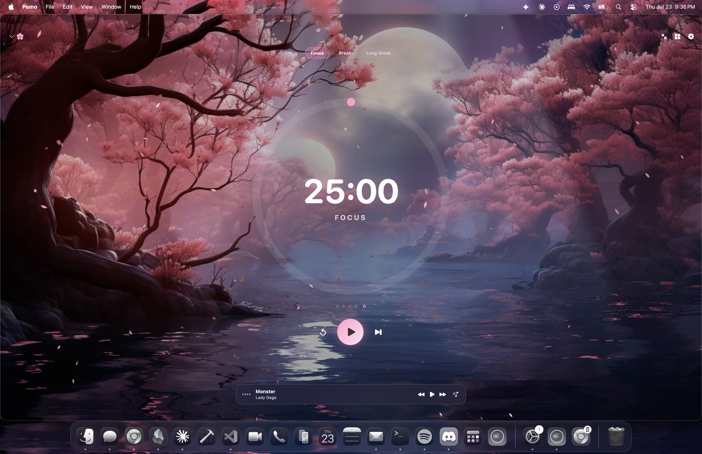

<details>
<summary>More themes</summary>

| | |
|---|---|
| 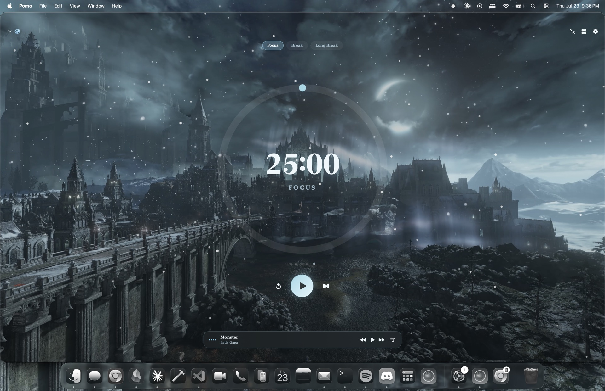 | 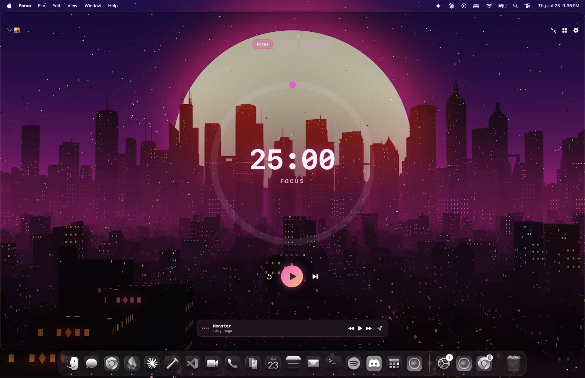 |
| Boreal Valley — snowfall particles | Neon Sunset — pixel & code rain |
| 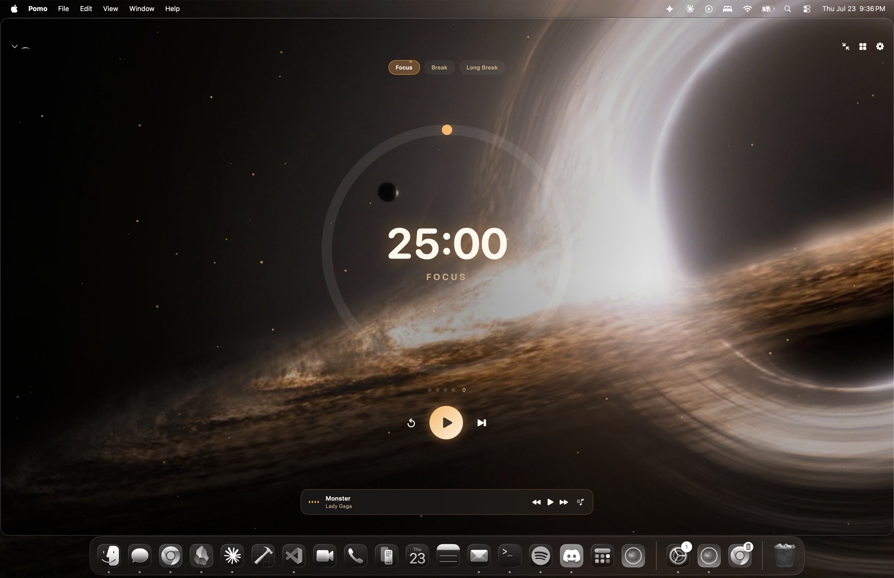 | 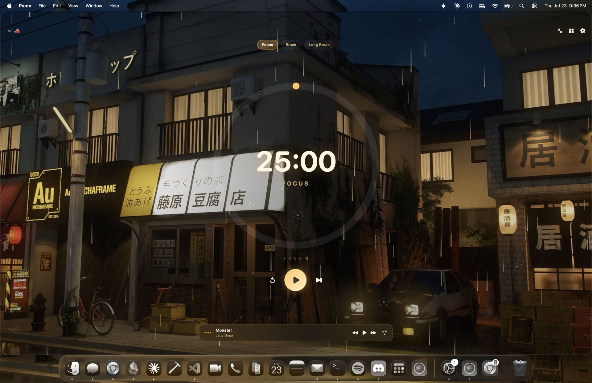 |
| Event Horizon — gravity well particles | Initial D — 3D rain |
| 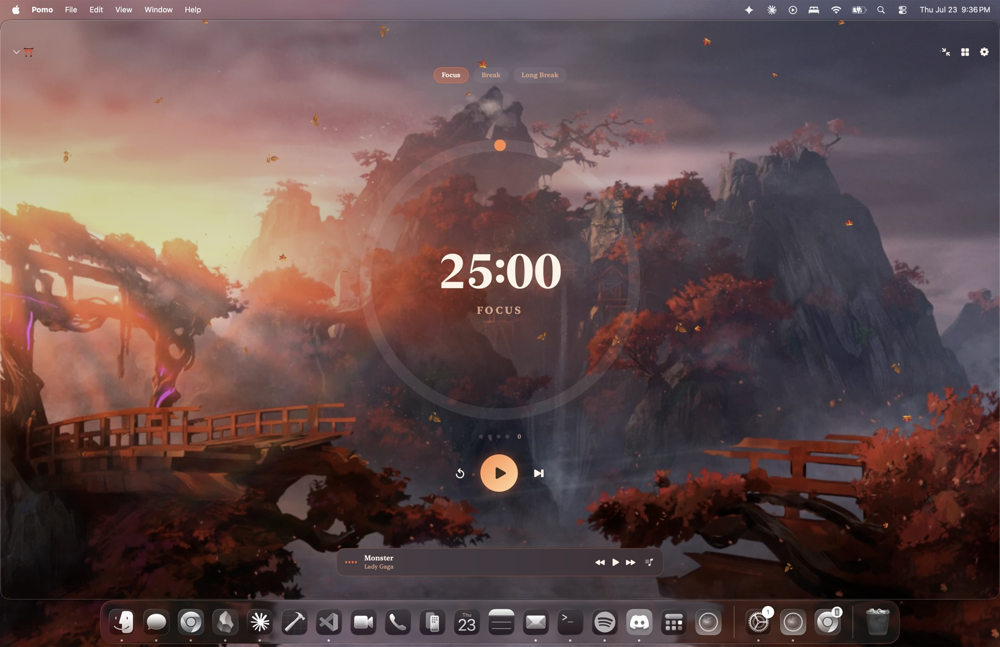 | 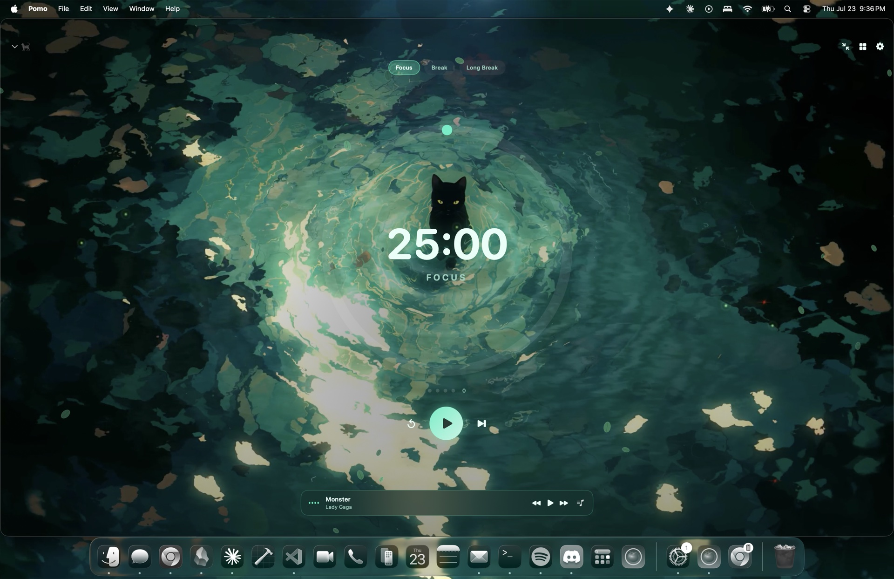 |
| Autumn Shrine — falling leaves | Swamp Spirit — fireflies |
| 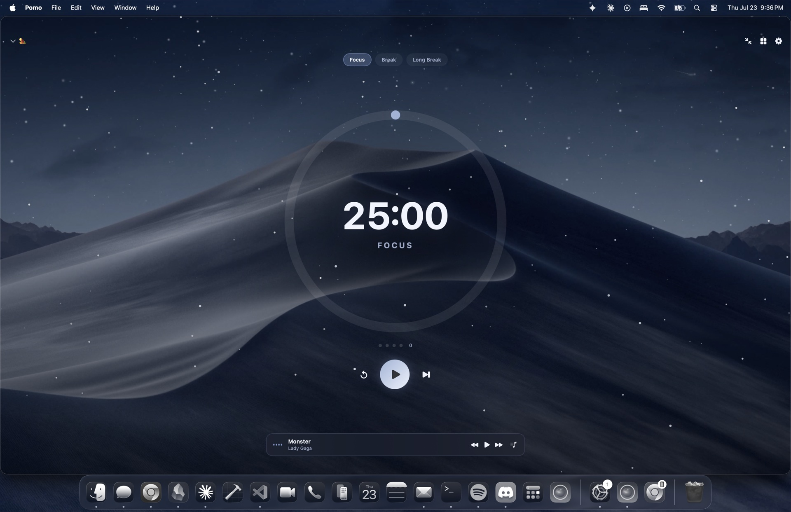 | 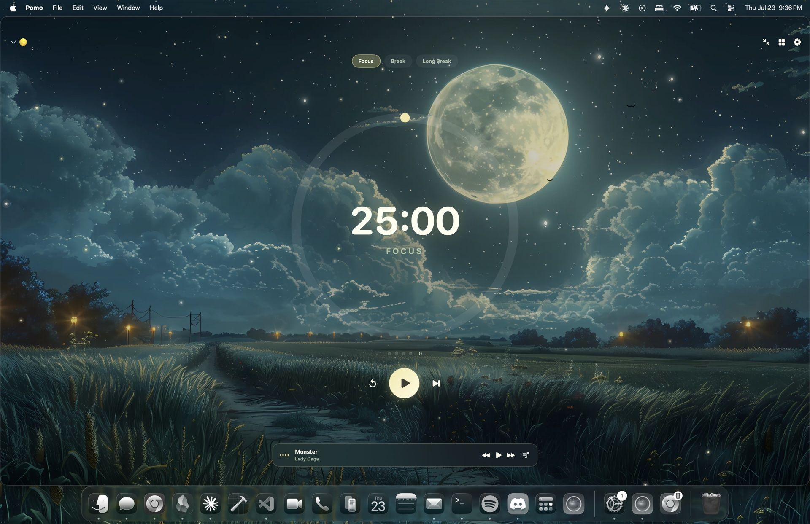 |
| Mojave Night — sand drift | Moonlit Meadow — fireflies & pond |
| 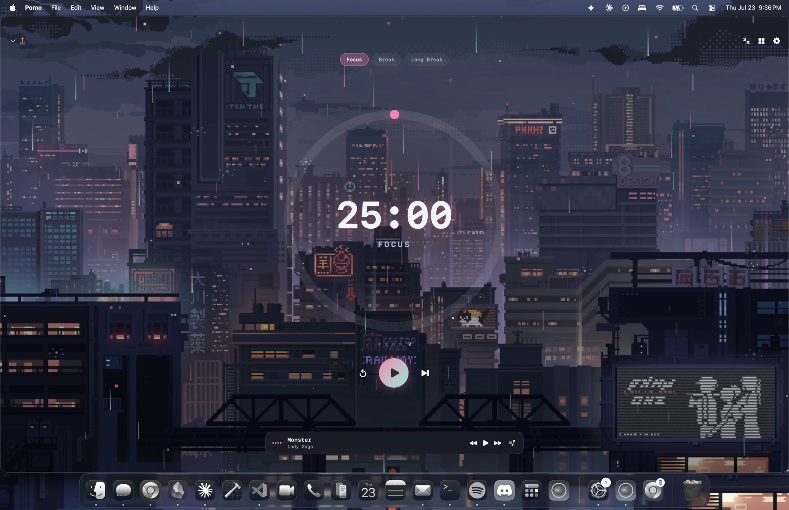 | |
| Pixel City — 8-bit pixels & code rain | |

</details>

### Habit Tracker

Side panels with daily habit tracking, completion ring, and calendar heatmap — toggleable with one click.

| Habits enabled | Habits disabled |
|---|---|
| 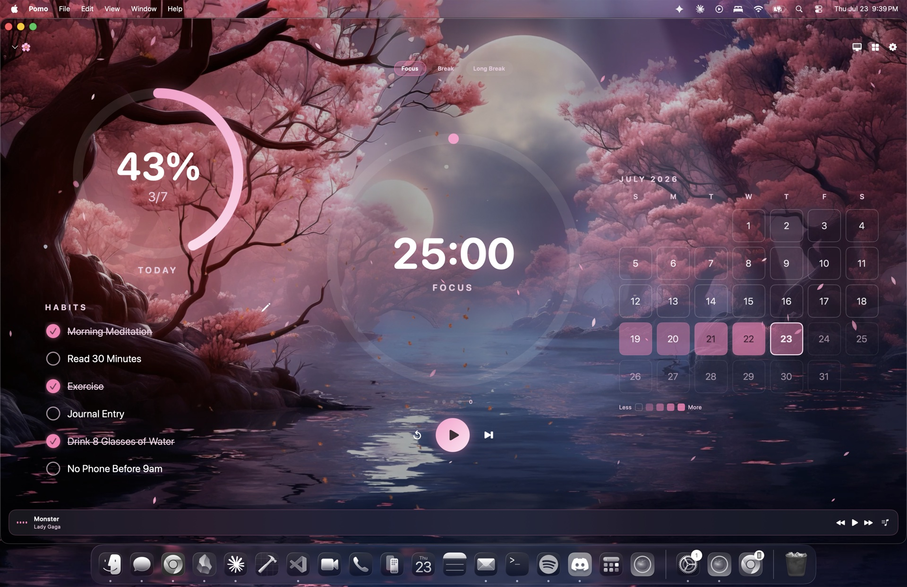 | 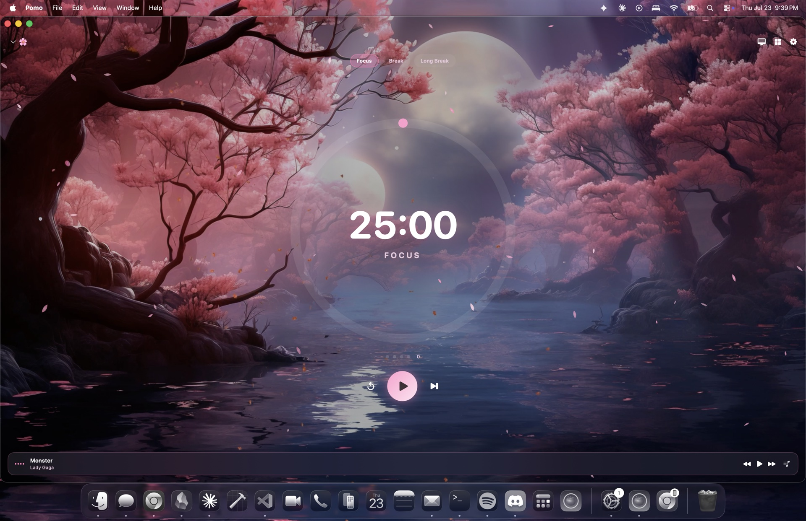 |

---

## Features

### Timer
- Configurable focus / short break / long break durations
- Auto-start next phase toggle
- Session counter with long-break cycling
- Animated ring with orbiting comet, glow pulse, and optional breathing effect
- Completion sound

### 25 Built-in Themes

Every theme ships a curated color palette, ring gradient, font style, and particle effect pairing:

| # | Theme | Particles |
|---|-------|-----------|
| 1 | 🌸 Sakura Moon | Sakura Petals |
| 2 | 🚗 Initial D | 3D Rain |
| 3 | 🐈‍⬛ Swamp Spirit | Fireflies |
| 4 | ❄️ Boreal Valley | Snowfall, Starfield |
| 5 | 🌕 Moonlit Meadow | Fireflies, Pond |
| 6 | 🌆 Neon Sunset | 3D Rain, Code Rain |
| 7 | 🏜️ Mojave Night | Sand Drift, Starfield |
| 8 | ⛩️ Autumn Shrine | Autumn Leaves |
| 9 | 🕳️ Event Horizon | Gravity Well, Starfield |
| 10 | 🫧 Glass | Ripples & Fish |
| 11 | 🕹️ Pixel City | 8-bit Pixels, Code Rain |
| 12 | 🔥 Campfire | Embers, Smoke Wisps |
| 13 | 🌃 City Night | Bokeh Lights, 3D Rain |
| 14 | 💎 Crystal Cave | Sparkle, Geometric |
| 15 | 🎪 Carnival | Confetti, Bokeh Lights |
| 16 | 🏔️ Misty Peaks | Fog, Feathers |
| 17 | 🌌 Northern Lights | Aurora, Starfield |
| 18 | 🏮 Lantern Festival | Lanterns, Embers |
| 19 | 🪶 Soft Clouds | Feathers, Fog |
| 20 | 🌧️ Rainy Window | 3D Rain, Water Ripples |
| 21 | ☄️ Meteor Shower | Comet Trails, Starfield |
| 22 | 🌫️ Deep Fog | Fog, Smoke Wisps |
| 23 | 🔮 Sacred Geometry | Geometric, Sparkle |
| 24 | ⛈️ Thunderstorm | Lightning, 3D Rain |
| 25 | 🐋 Deep Ocean | Ripples & Fish, Sand Drift |

The **Glass** theme is special — it shows your actual macOS wallpaper through the window with a frosted-glass effect.

### 25 Particle Styles

Every particle system is fully interactive — particles react to your cursor and clicks.

| Style | Description |
|-------|-------------|
| Sakura Petals | Pendulum-swaying cherry blossoms that gust away from the cursor |
| Autumn Leaves | Tumbling leaves with spin and drift |
| 3D Rain | Parallax raindrops at multiple depths with glass splat effects |
| Code Rain | Matrix-style cascading green glyphs |
| Starfield | Twinkling points with stardust burst on click |
| Ripples & Fish | Schools of fish that flee the cursor; occasional shark |
| Snowfall | Swirling flakes that accumulate at the bottom edge |
| Fireflies | Glowing dots with sine-wave wandering |
| Sand Drift | Floating dust motes carried by gentle wind |
| Gravity Well | Particles orbiting the cursor like a black hole |
| 8-bit Pixels | Retro pixel sprites with chunky movement |
| Pond Leaves & Ripples | Floating lily pads with ambient ring effects |
| Embers | Rising hot sparks with orange glow and flicker |
| Bokeh Lights | Large soft circles drifting slowly with subtle pulse |
| Sparkle | Brief bright burst points that flash and fade |
| Confetti | Tumbling colored rectangles with spin |
| Smoke Wisps | Wispy particles that drift upward and expand |
| Aurora | Tall vertical streaks swaying in wave patterns |
| Lanterns | Glowing ovals that float upward like sky lanterns |
| Feathers | Gentle side-to-side floating descent |
| Water Ripples | Ambient expanding ring effects |
| Comet Trails | Fast-moving streaks across the screen |
| Fog | Very large, slow-moving transparent haze |
| Geometric | Rotating polygons (hexagons and triangles) drifting slowly |
| Lightning | Periodic bright flash effects with ambient dots |

### Interactive Effects
- **Cursor reactions** — particles flee, orbit, gust, or brighten near the mouse
- **Click bursts** — each style has a unique click response (splashes, shockwaves, repulsion)
- **Parallax video** — background pans subtly as you move the mouse
- Adjustable **particle density** and **size** sliders
- Per-theme **layer toggles** — enable/disable individual FX layers
- **Manual particle override** — choose any particle style for any theme, or leave on Auto

### Auto-Theming (Drop Any Video)
1. Place video files (`.mp4`, `.mov`, `.m4v`) in `~/Library/Application Support/Pomo/Videos/`
2. On launch, Pomo analyzes each video's color palette using k-means clustering
3. A complete theme is auto-generated — background gradient, ring colors, accent, text colors, font style, glow intensity, and emoji
4. The best-matching particle style is auto-selected based on color temperature, brightness, and saturation
5. Custom themes appear in the theme picker alongside the built-in 25

### Wallpaper Adapting (Glass Theme)
- The Glass theme reads your current macOS wallpaper
- Colors adapt to whatever you're using
- Frosted-glass blur effect on cards and panels

### Desktop Mode
- **Immersive mode** syncs your Mac's wallpaper, dark mode, and accent color to the current theme
- **Desktop mode** (`⌘D`) — the app window drops behind all other windows and becomes your desktop background
- Live video wallpaper layer that plays at the desktop level
- Battery saver automatically drops to 1080p decode when unplugged
- Self-healing wallpaper restore — your original wallpaper is always restored on quit (even after crashes)

### Widget
- macOS widget extension shows timer state on your desktop/notification center
- Shared state via app group (real-time sync between app and widget)
- Start/pause/skip via widget intents

### Spotify Integration
- Built-in Spotify bar shows now-playing with album art
- Play/pause, skip, and previous controls
- Animated equalizer bars

### Habit Tracker
- Side panels with daily habit tracking
- Persistent storage
- Expandable when window is wide enough

---

## Setup

### Requirements
- macOS 14.0 (Sonoma) or later
- Xcode 15+ (for building)
- [XcodeGen](https://github.com/yonaskolb/XcodeGen) (optional — for regenerating the Xcode project from `project.yml`)

### Build & Run

1. **Clone the repo**
   ```bash
   git clone https://github.com/YOUR_USERNAME/Pomo.git
   cd Pomo
   ```

2. **Set your team ID**

   Open `Pomo.xcodeproj/project.pbxproj` and replace all instances of `YOUR_TEAM_ID` with your Apple Developer Team ID. You can find it in Xcode under **Settings > Accounts**, or in your [Apple Developer portal](https://developer.apple.com/account).

   ```bash
   sed -i '' 's/YOUR_TEAM_ID/YOUR_ACTUAL_TEAM_ID/g' Pomo.xcodeproj/project.pbxproj
   ```

   > **Free signing works.** You don't need a paid Apple Developer account. Use your personal team (your Apple ID) — Xcode will handle provisioning automatically. The app group entitlement uses `$(TeamIdentifierPrefix)` so it adapts to any team.

3. **Open and build**
   ```bash
   open Pomo.xcodeproj
   ```
   Select the **Pomo** scheme, hit `⌘R` to build and run.

4. **(Optional) Regenerate project from spec**
   If you modify `project.yml`:
   ```bash
   brew install xcodegen
   xcodegen generate
   ```

### Adding Your Own Videos

Drop any video file into the Videos directory:
```bash
mkdir -p ~/Library/Application\ Support/Pomo/Videos
cp your-video.mp4 ~/Library/Application\ Support/Pomo/Videos/
```

Pomo will auto-generate a theme from the video's color palette on the next launch. Name files `vid-mytheme.mp4` to get a theme ID of `mytheme`, or use any filename — the stem becomes the ID.

For battery saver mode (1080p fallback), also drop a lower-res version at:
```
~/Library/Application Support/Pomo/Videos-1080/vid-mytheme.mp4
```

---

## Architecture

```
Pomo/
├── App/
│   ├── PomoApp.swift          # App entry point, delegate, lifecycle
│   ├── ContentView.swift      # Main UI — timer ring, controls, header
│   ├── SettingsView.swift     # Settings panel with theme grid, FX controls
│   ├── PomoEngine.swift       # Timer logic, state management
│   ├── InteractiveFX.swift    # Particle physics engine (Canvas fallback)
│   ├── FXLayers.swift         # Core Animation particle renderer (performance path)
│   ├── ColorExtractor.swift   # Color analysis — k-means clustering, particle selection
│   ├── SceneArt.swift         # Theme media, video discovery, auto-theme generation
│   ├── VideoBackground.swift  # AVPlayerLooper, video decode pooling
│   ├── ImmersiveMode.swift    # Wallpaper sync, accent color, dark mode
│   ├── DesktopMode.swift      # Desktop-level window, power monitoring
│   ├── Spotify.swift          # Spotify AppleScript integration
│   ├── Habits.swift           # Habit data model and persistence
│   └── HabitTrackerView.swift # Habit panel UI
├── Shared/
│   ├── Theme.swift            # 25 themes, particle style enum, color utilities
│   ├── TimerCore.swift        # Timer state model shared between app and widget
│   └── PomoIntents.swift      # App Intents for widget actions
├── Widget/
│   └── PomoWidget.swift       # macOS widget extension
├── Media/                     # Bundled still images for themes
└── project.yml                # XcodeGen project specification
```

### Rendering Pipeline

Pomo uses a dual-path particle renderer for performance:

1. **Core Animation path** (`FXLayers.swift`) — each particle is a `CALayer`. The GPU composites them with no per-frame draw calls. This is the primary path and handles all 25 particle styles.

2. **Canvas fallback** (`InteractiveFX.swift`) — SwiftUI `Canvas` with `TimelineView` for contexts where CA layers aren't available. Contains the full particle physics simulation (positions, velocities, lifecycles, mouse interaction).

Video decode is shared between the in-app background and the immersive wallpaper layer via `VideoPlayerPool`, with `DecodeGate` throttling based on screen sleep, app visibility, and window occlusion.

---

## Permissions

On first use, Pomo may request:
- **System Events** (Automation) — to toggle dark mode in immersive mode
- **Screen Recording** — only if you use the Glass theme (to read your wallpaper)

No network access is required. No data leaves your machine.

---

## License

[MIT](LICENSE)
